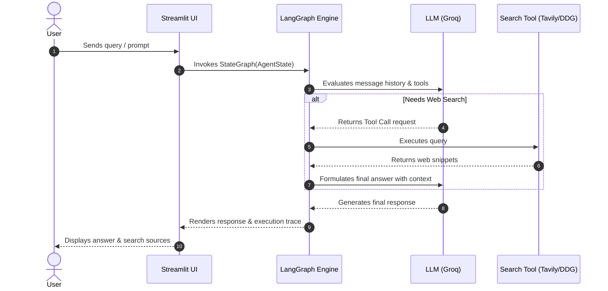

# Agentic Web Search Chatbot

[](https://www.python.org/downloads/)
[](https://github.com/langchain-ai/langgraph)
[](https://streamlit.io/)
[](LICENSE)

A production-grade, stateful Agentic Web Search Chatbot built using LangGraph, Tavily Search API, Groq LLMs, and Streamlit. Designed with decoupled architecture, type safety via Pydantic, MemorySaver state checkpointers, Human-In-The-Loop (HITL) tool interrupts, fallback tool execution, and automated test coverage.

---

## Key Features

- **StateGraph Orchestration:** Dual execution paths (Basic LLM mode and Tool-Augmented Agentic Search mode).
- **Stateful Memory Checkpointer:** Integrated MemorySaver checkpointer supporting multi-turn conversation threads across sessions.
- **Human-In-The-Loop (HITL):** Configurable tool execution interrupts allowing human review before running external web search queries.
- **Real-Time Web Search:** Powered by Tavily API with graceful fallback to DuckDuckGo search.
- **Streamlit Interface:** User interface featuring real-time reasoning trace visualization, model switching, and thread session management.
- **Production Architecture:** Pydantic settings management, structured logging, error handling, and unit test coverage.
- **Containerized Deployment:** Includes Dockerfile for deployment across containerized environments.

---

## Architecture & Workflow



---

## Quick Start

### Prerequisites

- Python `>= 3.10`
- Groq API Key
- Tavily API Key (Optional)

### Installation

1. **Clone the repository:**
   ```bash
   git clone https://github.com/Hamza-HATTAB/agentic-web-chatbot.git
   cd agentic-web-chatbot
   ```

2. **Set up virtual environment & install dependencies:**
   ```bash
   python3 -m venv .venv
   source .venv/bin/activate
   pip install -e .
   ```

3. **Configure environment variables:**
   ```bash
   cp .env.example .env
   # Edit .env and insert your GROQ_API_KEY and TAVILY_API_KEY
   ```

4. **Launch the application:**
   ```bash
   streamlit run app.py
   ```

---

## Testing

Run the automated test suite with pytest:

```bash
pytest tests/
```

---

## Docker Deployment

Build and run using Docker:

```bash
docker build -t agentic-web-chatbot .
docker run -p 8501:8501 --env-file .env agentic-web-chatbot
```

---

## License

Distributed under the MIT License. See `LICENSE` for more information.
